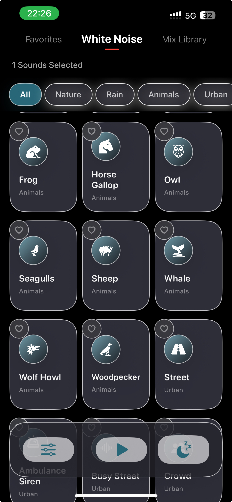
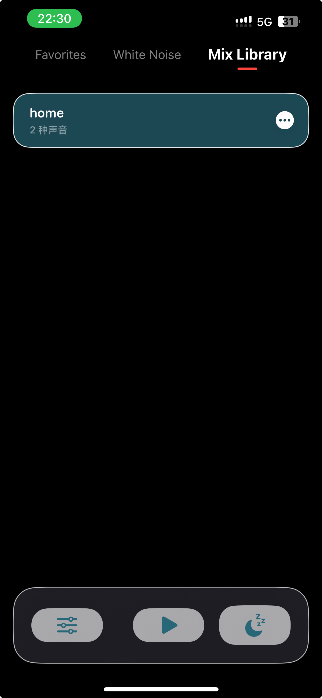

# WhiteNoisePlayer

WhiteNoisePlayer is an iOS white-noise and ambient-sound player built with SwiftUI. This version focuses on a clean listening experience for sleep, focus, relaxation, and noise masking. Users can browse categorized sounds, mix multiple tracks, adjust individual volumes, save favorite combinations, use a sleep timer, and keep playback running in the background.

## Screens 





## Current Version

This release is a feature-complete foundation version. The core audio playback flow, sound library, favorites, mix saving, sleep timer, cache, background playback, and lock-screen controls are already in place. 

## Features

- Multi-track ambient sound playback
- Up to 6 concurrent sounds in one mix
- Per-sound volume control
- Sleep timer with quick duration choices
- Favorites library for frequently used sounds
- Custom mix library with save, rename, delete, and replay support
- Category-based browsing
- Remote audio loading with local disk cache
- Background audio mode
- Lock-screen and Control Center playback controls
- SwiftData persistence for favorites and saved mixes

## Sound Categories

The sound library is loaded from `WhiteNoisePlayer/sounds.json` and currently includes these categories:

- Nature
- Rain
- Animals
- Urban
- Places
- Transport
- Things

Each sound entry includes an id, display name, icon or image symbol, category, and remote audio URL.

## Tech Stack

- Swift
- SwiftUI
- SwiftData
- AVFoundation
- Combine
- MediaPlayer remote command support
- URLSession download-based audio loading
- Local cache with LRU-style eviction

## Project Structure

```text
WhiteNoisePlayer/
├── Models/
│   ├── CollectedSound.swift
│   ├── Mixsound.swift
│   └── Sound.swift
├── Services/
│   ├── CollectionStore.swift
│   ├── MixLibraryStore.swift
│   └── SoundDataManager.swift
├── Utils/
│   └── ColorTheme.swift
├── VIewModels/
│   └── PlayerViewModel.swift
├── Views/
│   ├── CategoryBarView.swift
│   ├── Collection.swift
│   ├── ContentView.swift
│   ├── ControlBarView.swift
│   ├── HomeView.swift
│   ├── MixLibraryView.swift
│   ├── SoundCardView.swift
│   ├── SoundGridPagerView.swift
│   ├── SoundGridView.swift
│   └── SoundSettingsView.swift
├── Assets.xcassets/
├── sounds.json
└── WhiteNoisePlayerApp.swift
```

## How To Run

1. Open `RainSleep.xcodeproj` in Xcode.
2. Select the app target.
3. Choose an iPhone simulator or a physical iOS device.
4. Build and run.

Background playback is enabled through `UIBackgroundModes` with the `audio` mode in `WhiteNoisePlayer/Info.plist`.

## Product Positioning

Recommended positioning for this app:

> A clean, no-account, no-ads white noise mixer for sleep, focus, and relaxation.

The strongest commercial angle is not "more sounds" alone. The value should come from a simple, reliable, low-friction listening ritual:

- Tap once to play a familiar mix
- Save personal sound combinations
- Use sleep timer every night
- Keep favorite sounds offline and ready
- Avoid ads and unnecessary accounts

## Suggested Monetization

The recommended model for the current stage is freemium plus a low-price Pro unlock.

Free version:

- Core playback
- A limited set of sounds
- Sleep timer
- Favorites
- Basic mixing

Pro version:

- Full sound library
- Unlimited saved mixes
- Built-in official presets
- Advanced timer behavior
- Offline cache controls
- One-time unlock with optional low-cost subscription later

Suggested pricing direction:

- Lifetime unlock: USD 4.99-6.99
- Launch promotion: USD 2.99
- Optional annual plan later: USD 9.99-14.99

Avoid intrusive advertising. Sleep and focus apps depend on calmness and trust, and ads can quickly damage retention and reviews.

## Recommended Next Improvements

High priority:

- Add a lightweight first-launch onboarding flow
- Add built-in preset mixes such as Deep Sleep, Rainy Night, Focus Room, Cozy Fireplace, and Baby Sleep
- Restore the last active mix when the user reopens the app
- Improve offline and failed-download states
- Make bottom control icons more self-explanatory for first-time users

Medium priority:

- Add recent mixes
- Add scene-based browsing: Sleep, Focus, Relax, Baby, Travel, Noise Masking
- Add Pro paywall copy and upgrade entry points
- Add simple analytics for sound plays, mix saves, timer usage, and paywall conversion
- Polish App Store screenshots and listing copy

Future ideas:

- iCloud sync for favorites and mixes
- Home Screen widgets for one-tap playback
- Shortcuts support
- More noise colors such as brown, pink, and green noise
- Curated daily or seasonal soundscapes

## App Store Copy Draft

Short subtitle:

> White noise mixer for sleep and focus

Description draft:

> WhiteNoisePlayer helps you create calm soundscapes for sleep, focus, relaxation, and noise masking. Mix rain, waves, wind, fire, city ambience, transport sounds, and more. Save your favorite combinations, adjust each sound individually, and fall asleep with a built-in timer. No account required.

Key phrases:

- White noise
- Sleep sounds
- Rain sounds
- Focus sounds
- Ambient sound mixer
- Relaxation sounds
- Background audio
- Sleep timer

## Development Notes

- See `docs/EngineKitGuide.md` for guidance on reusing the engine as an internal Audio Engine Kit in future projects.
- `PlayerViewModel` exposes playback state and user intents to SwiftUI views.
- `CollectionStore` and `MixLibraryStore` persist user data with SwiftData.
- `NetworkLoader` downloads audio files and stores them through `AudioCache`.
- `NowPlayingManager` integrates with lock-screen playback controls.
- `sounds.json` is the main content source for the audio library.

## Status

This project is ready for product polish, testing, and monetization preparation. The next milestone should be a release candidate with onboarding, preset mixes, clearer empty states, App Store assets, and a simple Pro unlock plan.
