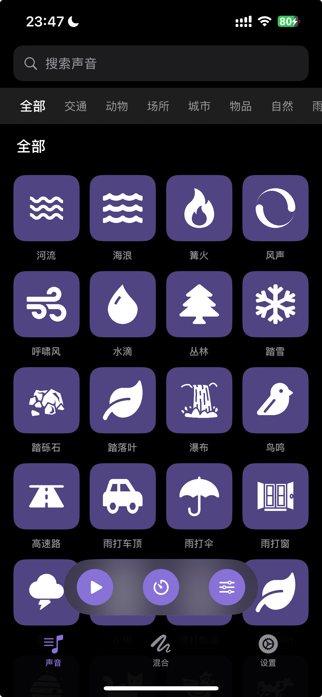
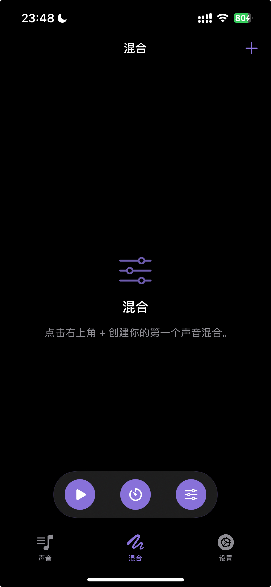
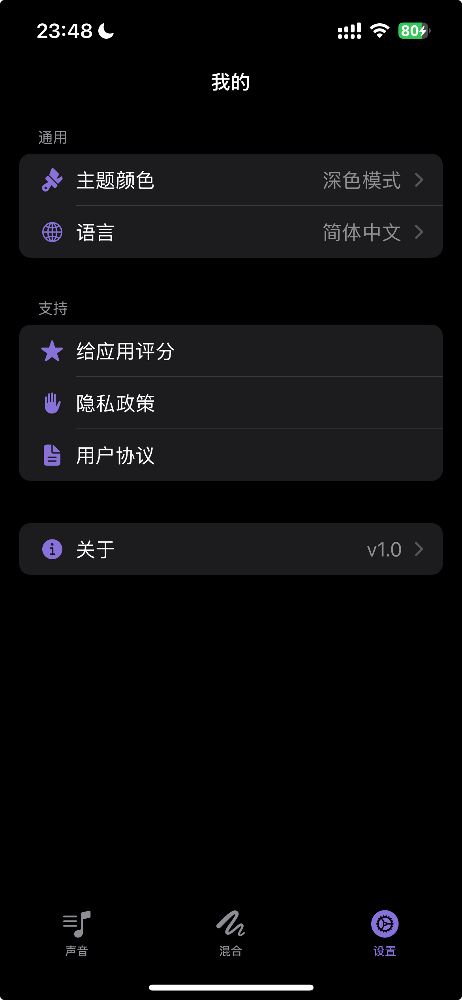

# Whisper - 治愈系环境音与白噪音

Whisper 是一款精心设计的白噪音与环境音应用程序，旨在帮助用户放松身心、提高专注力、改善睡眠质量。通过精选的高质量自然音效和灵活的自定义混合功能，为您打造专属的宁静空间。

## 🌟 核心功能

- **丰富的声音库**：收录了自然、雨天、动物、城市、场所、交通和物品等多种类别的音效。
- **自定义声音混合**：支持同时播放多个声音，并可独立调节每个声音的音量，创造出属于您自己的独特氛围。
- **定时睡眠**：内置睡眠定时器，让您在宁静的声音中入睡，无需担心电量消耗。
- **个性化设置**：支持多语言切换（中文/英文）、深浅色模式以及多种主题颜色，满足您的个性化偏好。
- **收藏与置顶**：收藏您喜爱的声音，并将常用的声音或混合置顶，方便快速开启。

## 📸 应用截图

<div align="center">
  
  
  
</div>

## 🛠️ 技术栈

- **SwiftUI**：构建现代、流畅的声明式用户界面。
- **AVFoundation**：实现高质量的多声道音频混合播放。
- **Combine**：处理异步响应式数据流。
- **StoreKit**：集成应用内评价等功能。

## 🚀 快速开始

1. 环境要求：iOS 16.0+ / Xcode 15.0+
2. 克隆项目：
   ```bash
   git clone https://github.com/chenlin1037/Whisper.git
   ```
3. 打开 `Whisper.xcodeproj` 并运行。

## 📄 许可证

本项目采用 [MIT License](LICENSE) 许可。
